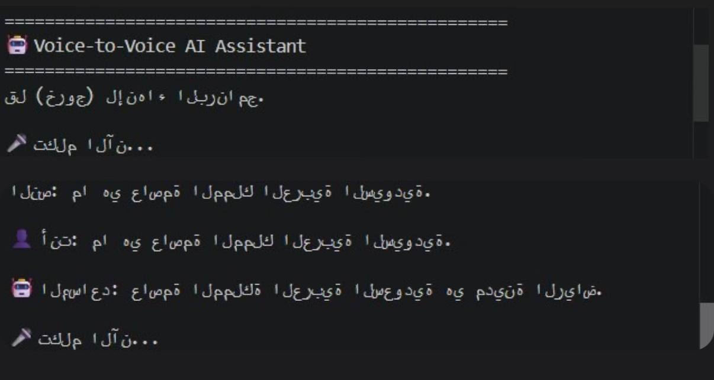

# 🎙️ Voice-to-Voice AI Assistant

An Arabic Voice-to-Voice AI Assistant built with Python. The assistant listens to the user's speech, converts it to text, generates an intelligent response using Cohere Command R7B Arabic, then converts the response back to speech.

---

## 🎥 Demo


https://github.com/user-attachments/assets/0e018b39-4974-42e7-a168-f01f60adce7a


---

## 📷 Screenshots



---

## ✨ Features

- 🎤 Speech-to-Text using RealtimeSTT and Faster-Whisper.
- 🧠 AI-generated responses using Cohere Command R7B Arabic.
- 🔊 Text-to-Speech using Edge-TTS.
- 🌍 Arabic language support.
- 🔄 Continuous conversation without restarting the application.

---

## 🛠️ Technologies Used

- Python 3.13
- RealtimeSTT
- Faster-Whisper
- Cohere API (Command R7B Arabic)
- Edge-TTS
- Pygame
- Python-dotenv

---

## 📂 Project Structure

```text
Voice-to-Voice-AI-Assistant/
│
├── main.py
├── speech_to_text.py
├── llm.py
├── text_to_speech.py
├── requirements.txt
├── README.md
├── screenshots/
├── .gitignore
└── .env
```

---

## ⚙️ Installation

Clone the repository:

```bash
git clone https://github.com/YOUR_USERNAME/Voice-to-Voice-AI-Assistant.git
```

Go to the project folder:

```bash
cd Voice-to-Voice-AI-Assistant
```

Install the required packages:

```bash
pip install -r requirements.txt
```

Create a `.env` file and add your Cohere API key:

```env
COHERE_API_KEY=YOUR_API_KEY
```

---

## ▶️ Run

```bash
python main.py
```

---

## 🔄 Workflow

```text
User Voice
     │
     ▼
Speech-to-Text
     │
     ▼
Cohere Command R7B Arabic
     │
     ▼
Text-to-Speech
     │
     ▼
Audio Response
```
---

## 👩‍💻 Developer

**Sama Alzahrani**

Computer Engineering Student

Taif University

https://github.com/user-attachments/assets/a7136239-ba40-4dd4-b6da-cf3242ce1e13


https://github.com/user-attachments/assets/213dea13-c488-4c94-9bdf-32747507bf06

